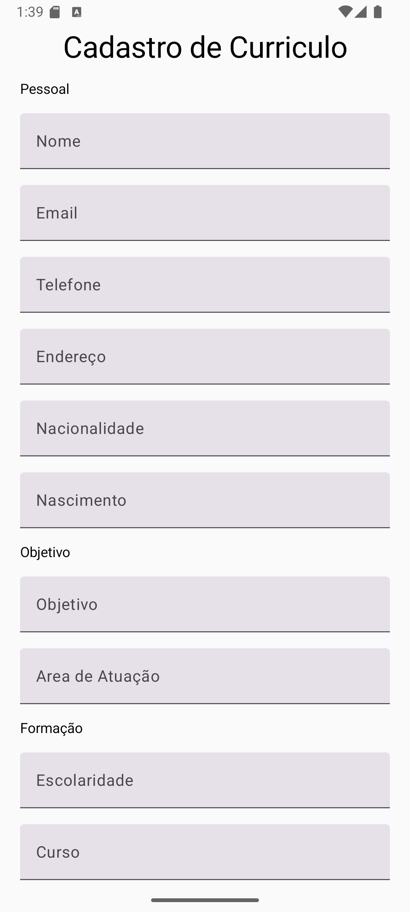
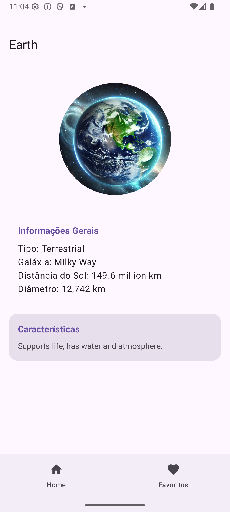
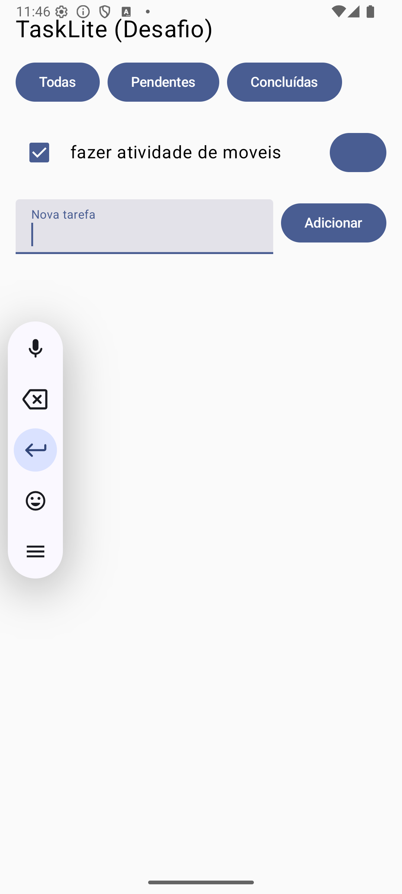
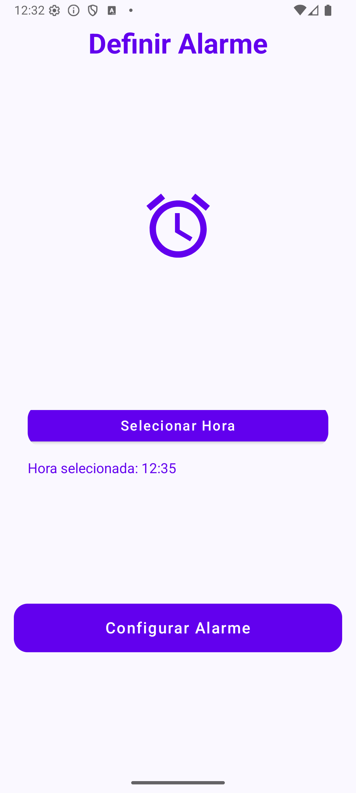
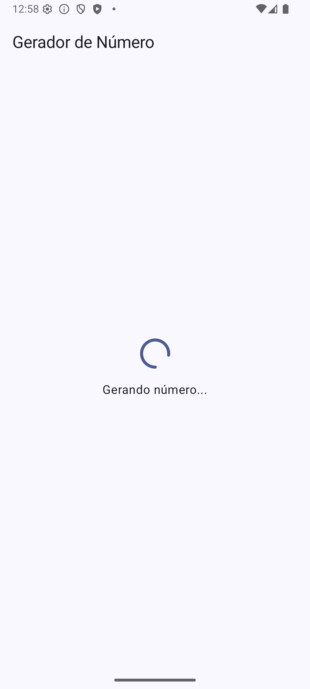

# Desenvolvimento de Software para Dispositivos Móveis

Repositório para disciplina de desenvolvimento para dispositivos móveis na UFC

## Sobre a disciplina

A disciplina de Desenvolvimento de Software para Dispositivos Móveis tem como objetivo apresentar conceitos, técnicas e ferramentas essenciais para o desenvolvimento de aplicativos móveis. O foco principal está no uso do Android nativo, utilizando a linguagem Kotlin e o framework Jetpack Compose para a construção de interfaces modernas e reativas. Nós aprendemos sobre arquitetura de aplicações, interfaces gráficas, persistência de dados, consumo de APIs e publicação de aplicativos, sempre aplicando práticas atuais do ecossistema Android e exemplos práticos.

## Aplicativos

| Aplicativo              | Descrição                                                                 | Screenshot                                                                                     | Link                                   |
|-------------------------|---------------------------------------------------------------------------|-----------------------------------------------------------------------------------------------|----------------------------------------|
| **CrudApp**             | Aplicativo de cadastro, leitura, atualização e remoção de itens (CRUD).   |                   | [Abrir CrudApp](./CrudApp/)            |
| **CadApp**              | App simples para cadastro de usuários com formulário e validação.          |  | [Abrir CadApp](./exercicio_1/CadApp/)  |
| **NightEventsAppTarefa**| Lista e detalha eventos noturnos, com informações e imagens.               |  | [Abrir NightEventsAppTarefa](./NightEventsAppTarefa/) |
| **PlanetApp**           | Mostra planetas do sistema solar com dados e imagens ilustrativas.         |  | [Abrir PlanetApp](./PlanetApp/)        |
| **PostApp**             | Consome uma API para exibir e cadastrar posts de usuários.                 |                   | [Abrir PostApp](./PostApp/)            |
| **TaskLiteApp**         | Gerenciador simples de tarefas com marcação de concluídas.                 |  | [Abrir TaskLiteApp](./TaskLiteApp/)    |
| **TasksManagerApp**     | Aplicativo para gerenciamento avançado de tarefas e projetos.              |   | [Abrir TasksManagerApp](./TasksManagerApp/) |
| **ZooApp**              | Apresenta animais de zoológico com informações e imagens.                  |                     | [Abrir ZooApp](./ZooApp/)              |
| **AlarmApp**            | Aplicativo para configurar alarme.             |  | [Abrir AlarmApp](./AlarmApp/)          |
| **NumberGeneratorApp**  | Gera números aleatórios.        |  | [Abrir NumberGeneratorApp](./NumberGeneratorApp/) |

> **Nota:** Caso algum aplicativo não possua imagem, a célula correspondente ficará vazia.

