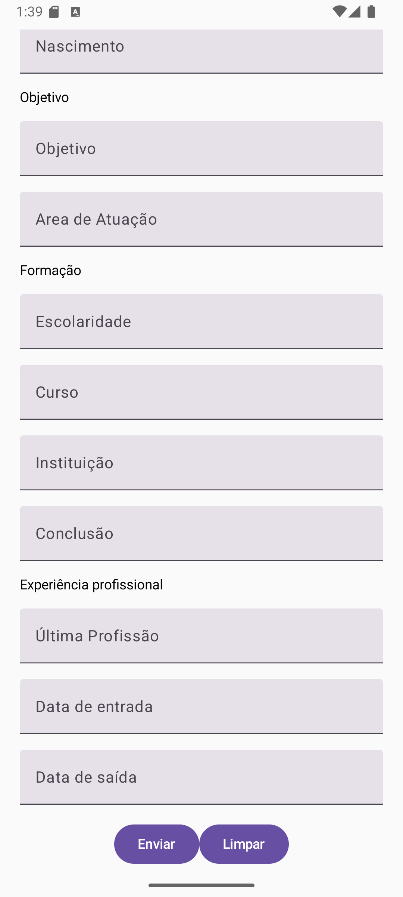

# Lista de exercícios 1 - CadApp

Nesta atividade, o objetivo é desenvolver somente a interface de um formulário de cadastro completo utilizando os conceitos introdutórios de Jetpack Compose. O foco desta tarefa está na prática com os componentes básicos da biblioteca e no domínio da criação de layouts estruturados.

Imagem 1

Imagem 2
